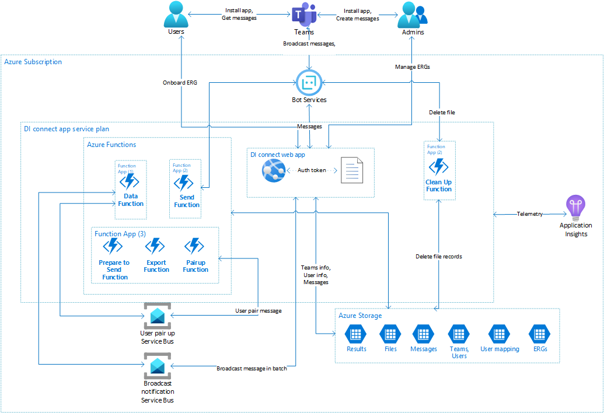

## Solution Overview

Refer the following image for high level architecture.

The **Diversity and Inclusion** app has the following main components:
* **App Service**: The app service implements the message compose experience in the team tab, and the messaging endpoint for the bot.
* **Service Bus**: The individual messages sent by the bot to the recipients are enqueued on a service bus queue, to be processed by an Azure Function. This queue decouples the message composition experience from the process that delivers the message to recipients.
* **Azure Function**: The Azure Functions picks up the messages from the queues, prepares the recipients and delivers them.
* **QnA Maker**: Resources that comprise the QnAMaker service, which implements the FAQ part of the application. The installer creates a knowledge base using the tools provided by QnAMaker.
* **Microsoft Graph API**: The app leverages Microsoft graph api's to [Search Groups](https://docs.microsoft.com/en-us/graph/api/group-list?view=graph-rest-1.0&tabs=http), [Get Group Transitive Members](https://docs.microsoft.com/en-us/graph/api/group-list-transitivemembers?view=graph-rest-1.0&tabs=http), [Get Users](https://docs.microsoft.com/en-us/graph/api/user-list?view=graph-rest-1.0&tabs=http) and [proactively install the User application for a user](https://docs.microsoft.com/en-us/graph/api/user-add-teamsappinstallation?view=graph-rest-beta&tabs=http).

---

## App Service

The app service implements two main components, the tab for composing messages and viewing their status, and the messaging endpoint for the bot.

### Messages tab

The messages tab is the interface by which message authors create the messages to be sent and specify the intended recipients. Once the message is sent, the tab reports the status of the message delivery, as counts of deliveries that were successful or failed.

The tab is implemented as a React application, using UI components from [Fluent UI](https://github.com/microsoft/fluent-ui-react) and [Office UI Fabric React](https://github.com/OfficeDev/office-ui-fabric-react). The message compose UX is in a [task module](https://docs.microsoft.com/en-us/microsoftteams/platform/concepts/task-modules/task-modules-overview), with a message preview implemented using the [Adaptive Cards SDK](https://docs.microsoft.com/en-us/adaptive-cards/sdk/rendering-cards/javascript/getting-started).

The tab's front-end gets its data from web APIs implemented by the same app service that's hosting it. These APIs are protected by AAD token authentication, which ensures that the user attempting to access the site is in the list of valid senders.

### Bot endpoint

The app service exposes a bot messaging endpoint, which receives activities from Bot Framework as the user interacts with the app.

**conversationUpdate:** When the app is installed in team, or personally by users, the [bot is notified](https://docs.microsoft.com/en-us/microsoftteams/platform/concepts/bots/bots-notifications) via a conversationUpdate activity. The bot uses these messages to keep track of the users and teams that have installed the app:
* The list of teams is used to populate the team picker in the compose UX.
* The bot tracks the Teams user ids (`29:xxx`) of the users that install the app, so that it can broadcast messages to them. [Proactive messaging in Teams](https://docs.microsoft.com/en-us/microsoftteams/platform/concepts/bots/bot-conversations/bots-conv-proactive) requires the bot to know this unique ID, which otherwise cannot be derived from their AAD ID or UPN.

**messageReaction:** When the user reacts to a message sent by the bot, Teams sends the bot a `messageReaction` [event](https://docs.microsoft.com/en-us/microsoftteams/platform/concepts/bots/bots-notifications#reactions). We don't use this information in the initial version, we plan to do so in the future.

**fileConsent:** When the user accepts/declines the file consent card sent by the bot, Team sends the bot a `fileConsentAccept` or `fileConsentDecline` [event](https://docs.microsoft.com/en-us/microsoftteams/platform/bots/how-to/conversations/send-and-receive-files?tabs=dotnet). On user's consent file is uploaded to the user's OneDrive.

**qnaBot** When the user asks the question  to the bot the bot responds with a adaptive card. This bot includes multi-turn feature. With the multi-turn feature, users will be presented with follow-up options along with an answer to their question. This enables the qna bot to answer the user's question with more relevance. Multi-turn follow-up options are programmed directly into the QnA Maker when the tenant admin uploads the Q&A pairs into the knowledge base.

---

## Azure Function

Diversity and Inclusion app uses six Azure Functions:

### Prepare To Send function

This is a [durable function](https://docs.microsoft.com/en-us/azure/azure-functions/durable/durable-functions-overview?tabs=csharp) and is executed for every message in the "prepare-to-send" Service Bus queue. The function does following:
1. Stores the message.
2. Syncs the recipients. 
   > **Note:** Send to everyone workflow syncs all the users in the tenant. The code filters out **Guest** users and users who do not have a valid Teams license. You may change the behavior if desired. Refer - *SyncAllUsersActivity.cs*.
3. Proactively Installs the User app for recipients who do not have the app.
   >**Note:** Applicable if [proactive app installation](https://github.com/OfficeDev/microsoft-teams-apps-diversityandinclusion-preview/wiki/Deployment-guide#2.-deploy-to-your-azure-subscription) is enabled and external App Id is configured.
4. Sends a data aggregation trigger message to Data Queue.
5. Sends a dedicated message for every recipient to Send Message Queue.
6. Fetches resource groups.

It also manages the state of the notification. (if its syncing recipients/ installing app).

### Send function

This function is executed for every message in the "send" Service Bus queue. The message contains the delivery information for each recipient- message Id and recipient details. The function does following:
1. Checks if the conversationId is set for the recipient. If not, marks it as failed and exit.
2. Reads the message to be sent.
3. Sends the message to the recipient.
4. Stores the send status in an Azure table.
5. Syncs recipients and sends pair-up matches to queue.

### Data aggregation function

An instance of this function runs every 20 secs, while the app is actively delivering messages. For each message that's currently in the sending state, the data aggregation function checks the delivery records created by the Send function, and updates the success/failure count.

### Export function

This is a [durable function](https://docs.microsoft.com/en-us/azure/azure-functions/durable/durable-functions-overview?tabs=csharp) and is executed for every message in the "export" Service Bus queue. The function does following:
1. Reads all the recipients for the message.
2. Creates and stages the zip file in Azure Blob Storage.
3. Sends the File Consent Card to user to upload the file to User's One Drive.

### Clean Up function

This is a time trigger function and runs as per the scheduled time. It deletes the staged files and file consent card for which there is no response from user within a set period of time.

---

## Microsoft Graph API

### Delegated Permissions
App service requires the following `Delegated permission`:

|Sr. No.| Use Case | API|  Delegated permissions| API version
|--|--|--|--|--|
| 1. | Search Groups | GET [https://graph.microsoft.com/v1.0/groups?$filter=`condition`](https://docs.microsoft.com/en-us/graph/api/group-list?view=graph-rest-1.0&tabs=http) | Group.Read.All| v1.0
| 2. | Get App Catalog Id | GET [https://graph.microsoft.com/beta/appCatalogs/teamsApps?$filter=distributionMethod eq 'organization'](https://docs.microsoft.com/en-us/graph/api/teamsapp-list?view=graph-rest-beta&tabs=http) | AppCatalog.Read.All | Beta
| 3. | Retrieve a list of the group's owners| GET [https://graph.microsoft.com/beta/groups/{id}/owners](https://docs.microsoft.com/en-us/graph/api/group-list?view=graph-rest-1.0&tabs=http) | Group.Read.All | 

### App Permissions
Azure functions require the following `App Permissions` for different use cases:

|Sr. No.| Use Case | API|  Application permissions| API version
|--|--|--|--|--|
| 1. | Get All Users | GET [https://graph.microsoft.com/v1.0/users/delta](https://docs.microsoft.com/en-us/graph/api/user-delta?view=graph-rest-1.0&tabs=http) | User.Read.All | v1.0
| 2. | Get User | GET [https://graph.microsoft.com/v1.0/users/`user-id`](https://docs.microsoft.com/en-us/graph/api/user-get?view=graph-rest-1.0&tabs=http) | User.Read.All| v1.0
| 3. | Get Group Transitive Members | GET [https://graph.microsoft.com/v1.0/groups/`group-id`/transitiveMembers](https://docs.microsoft.com/en-us/graph/api/group-list-transitivemembers?view=graph-rest-1.0&tabs=http) | Group.Read.All| v1.0
| 4. | Get Teams App Installation Id | GET [https://graph.microsoft.com/beta/users/`user-id`/teamwork/installedApps?$expand=teamsApp&$filter=teamsApp/id eq '`teamsAppId`'](https://docs.microsoft.com/en-us/graph/api/user-list-teamsappinstallation?view=graph-rest-beta&tabs=http#example-2-get-the-names-and-other-details-of-apps-installed-for-the-user) | TeamsAppInstallation.ReadWriteForUser.All | Beta
| 5. | Get Chat Id | GET [https://graph.microsoft.com/beta/users/`user-id`/teamwork/installedApps/`teamsAppInstallationId`/chat]() | TeamsAppInstallation.ReadWriteForUser.All | Beta
| 6. | Install app for user | POST [https://graph.microsoft.com/beta/users/`user-id`/teamwork/installedApps](https://docs.microsoft.com/en-us/graph/api/user-add-teamsappinstallation?view=graph-rest-beta&tabs=http) | TeamsAppInstallation.ReadWriteForUser.All | Beta

### Internal API

|Call| API | Type|  Permission| Payload |Purpose| Request| Response
|--|--|--|--|--|--|--|--|
|Get All ERGs|/api/resourcegroups/discover|GET|Valid tenant user| NA |Get list of searchable employee resource groups|NA| "id": {string:GUID},"type": {enum: Teams/External},"name": "{string up to 100 chars}","description": "{string up to 300 chars}","groupLink": "{string with https:// validation}","imageLink": "{string with https:// validation}","tags": ["string”, “string”, “string”] up to 3 tags","location": "string"
|Get All ERGs for admin|/api/resourcegroups|GET|MustBeAdminTeamMembe|NA|Get list of all ERGs available for admin team (comms team)|NA| "groupId": {string:GUID}, "groupType": {enum: Teams/External}, "groupName": "{string up to 100 chars}", "groupDescription": "{string up to 300 chars}", "groupLink": "{string with https:// validation}", "imageLink": "{string with https:// validation}", "tags": "string;string;string up to 3 tags", "location": "string", "includeInSearchResults": "boolean", "approvalStatus": 0, "matchingFrequency": 0
|New ERG|/api/resourcegroups|POST|Valid tenant user|Employee resource group entity|Insert new group detail entity into azure table storage by validating Team details (if type is Teams) | "groupType": {enum: Teams/External}, "groupName": "{string up to 100 chars}", "groupDescription": "{string up to 300 chars}", "groupLink": "{string with https:// validation}", "imageLink": "{string with https:// validation}", "tags": [“string”, “string”, “string”], // semi-colon separated tags created from client side "location": "string", “includeInSearchResults”: boolean |NA
|Get ERG|/api/resourcegroups/{id}|GET|Valid tenant user|NA|Fetch ERG details from table storage |NA|"groupId": {string:GUID}, "groupType": {enum: Teams/External}, "groupName": "{string up to 100 chars}", "groupDescription": "{string up to 300 chars}", "groupLink": "{string with https:// validation}", "imageLink": "{string with https:// validation}", "tags": "string;string;string up to 3 tags", "location": "string", "includeInSearchResults": "boolean", "matchingFrequency": 0 
|Get ERG based on team id|/api/resourcegroups/teams/{teamid}|GET|MustBeTeamMember|Employee resource group entity|Get ERG details based on team id.Usage: in Teams scope where team member can see details about given ERG |NA|"groupId": {string:GUID}, "groupType": {enum: Teams/External}, "groupName": "{string up to 100 chars}", "groupDescription": "{string up to 300 chars}", "groupLink": "{string with https:// validation}", "imageLink": "{string with https:// validation}", "tags": "string;string;string up to 3 tags", "location": "string", "includeInSearchResults": "boolean", "matchingFrequency": 0 
|Update ERG|/api/ resourcegroups/{id}|PATCH|MustBeTeamOwner |Employee resource group entity|Only selected properties can be updated which will be passed from client |For Team Owners - “includeInSearchResults”: Boolean, “matchingFrequency”: {enum} For Admins - "groupType": {enum: Teams/External}, "groupName": "{string up to 100 chars}", "groupDescription": "{string up to 300 chars}", "groupLink": "{string with https:// validation}", "imageLink": "{string with https:// validation}", "tags": "string;string;string up to 3 tags", // semi-colon separated tags created from client side "location": "string", “includeInSearchResults”: boolean |NA
|Delete ERG|/api/ resourcegroups/{id}|DELETE|MustBeAdminTeamMember |Request URL will provide the resource group id|Delete from EmployeeResourceGroup and TeamsPairUpMapping table |NA|NA
|Get Microsoft Team teams details|/api/teamdata/{groupid}|GET|MustBeTeamMember|NA |Get team details|NA|“name”: string,  “description”: string 
|Validate user team owner|/api/teamdata/{groupid}/owner|GET|MustBeTeamMember|NA|NA|NA|True: when current user is team owner of provided group id . False: when current user is not a team owner of provided group id 
|Get application settings|Get application settings|GET|Valid tenant user|NA|Get appSettings value required at client level like MicrosoftAppId, Telemetry keys, etc.|NA|“appid”: string 
|Get app Knowledge base setting|/api/settingsknowledgebase|GET|MustBeAdminTeamMember|NA|Get QnA Maker knowledge base id from storage|NA|“qnamakerknowledgebaseid”: string 
|KnowledgeBase|/api/knowledgebasesettings|PATCH|MustBeAdminTeamMember|NA|Update QnA Maker knowledge base id from storage|“qnamakerknowledgebaseid”: string |NA